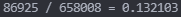

# YGO Dealer
游戏王手牌概率计算器（五张手牌）

# 使用方法
1. 下载 ygo_dealer_calculator.exe
2. 请将您的卡组ydk文件置于上述可执行文件同一文件夹内
3. 请将您的ydk更名为deck.ydk
4. 新建require.txt文件编写您的手牌需求（格式请见后文）
5. 运行可执行文件，获得回复（如下图）



# 需求文件格式
1. 每一行描述一种需求，使用`,`分割，分割的每一项格式形如`id<amount`
2. 符号可以是`<`、`>`或`=`，表示需要的`id`手牌与数量之间的关系
3. 使用`,`分割的每一项之间为“并且”关系
4. 如果有多种需求，请放置于多行，每一行之间为“或者”关系

如样例文件：
```
14558127>0,97268402>0
48800175>0,71039903>0
```
表示：
- 灰流丽多于0个且效果遮蔽者多于0个
- 龙觉醒旋律多于0个且太古的白石多于0个  
以上一项满足即可

# 更改手牌数量
若需要更改手牌数量，请修改Dfs函数中的层数：  
`Depth > 5`修改为`Depth > n`即可（n表示手牌数量）